## 6. Interface do sistema

_Visão geral da interação do usuário por meio das telas do sistema. Apresente as principais interfaces da plataforma._

## 6.1. Tela principal do sistema

_A tela principal do sistema é a visão do aluno sobre o sistema. Na qual ele pode ver todas as funções disponíveis para o login do mesmo. Podendo ver também a barra de progresso em cada uma das aulas._

## 6.2. Telas do processo 1

_Tela onde o aluno poderá acessar a função de solicitar comprovante de presença._

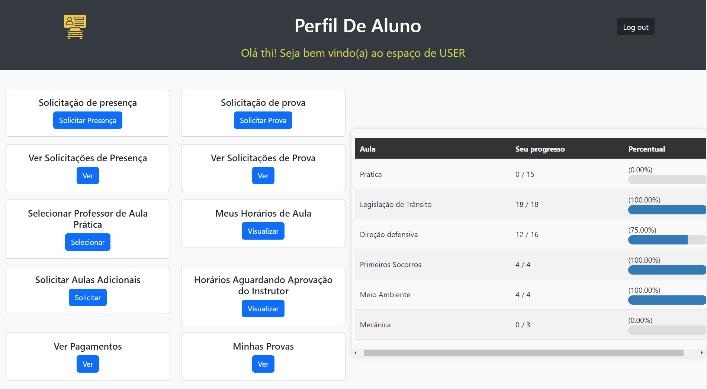

_Modal onde o aluno deve preencher as informações, de forma adequada, sobre a aula, para que não haja problemas na solicitação_

.png "Tela Usuario")

_Visão do administrador, onde ele pode ver as solicitações, analisar as mesmas e decidir se serão aprovadas ou negadas._

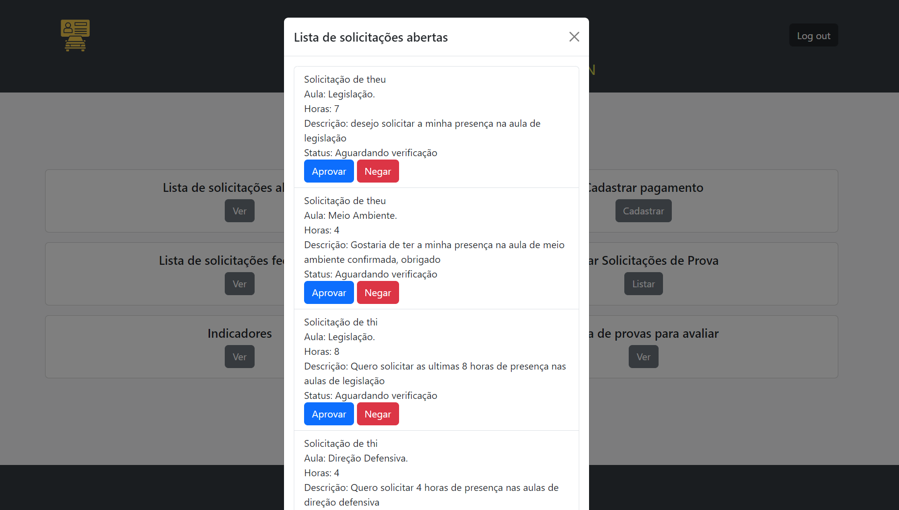

## 6.3. Telas do processo 2

_Modal em que o aluno pode escolher o tipo de prova que deseja solicitar e adicionr a descrição em forma de pedido._

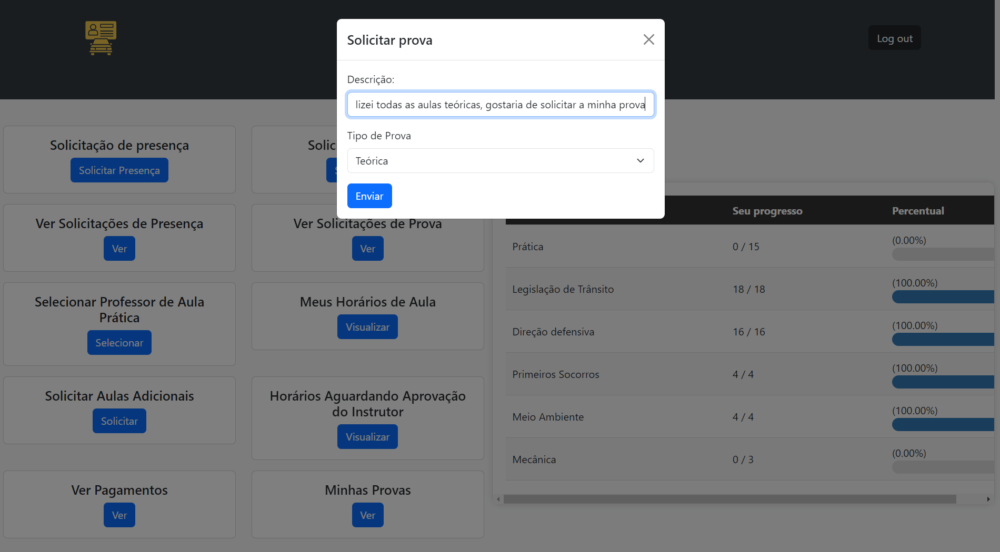

_Nessa tela, o aluno pode ver o status da solicitação de prova.._

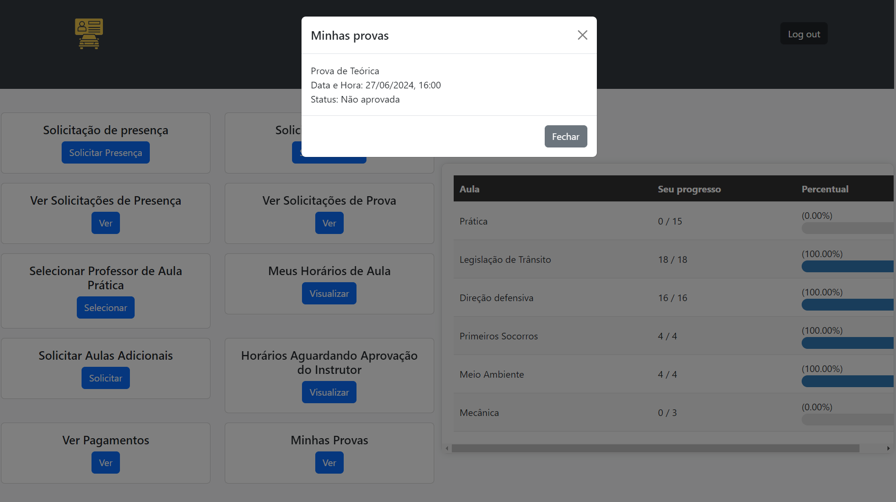

_Nessa tela, o administrador tem acesso a todas as solicitações de prova e o status do aluno que solicitou. Podendo aprovar o pagamento ou negar a solicitação ou cadastrar a prova._

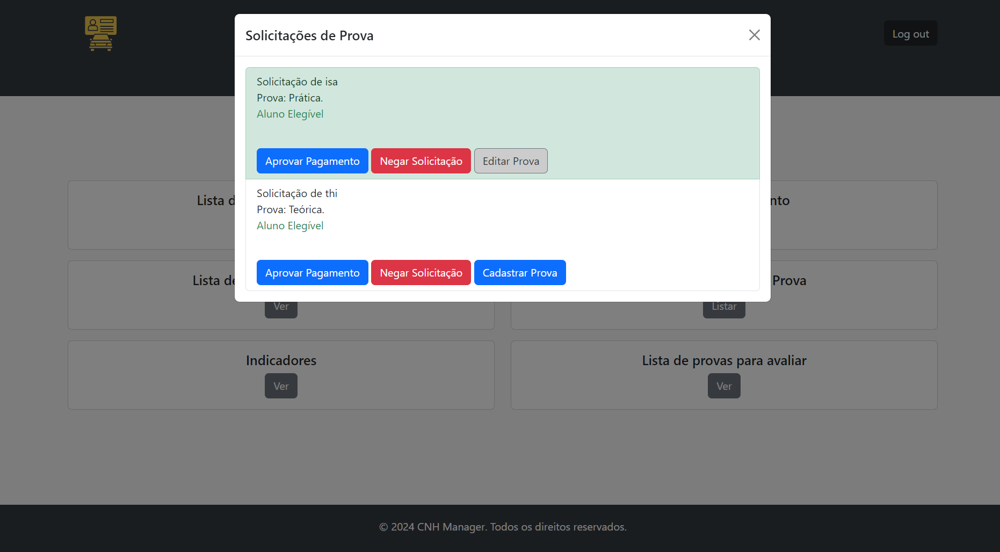

_Cadastro de prova por parte do administrador._

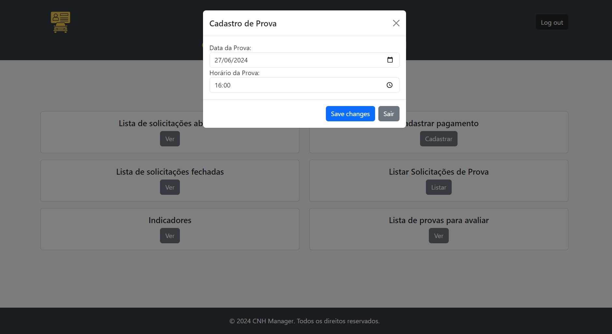

_Modal para as provas serem avaliadas.._

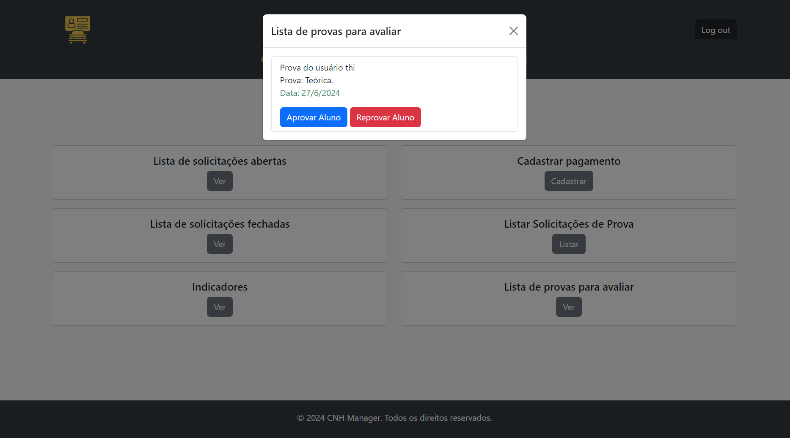

## 6.4. Telas do processo 3

_Descrição da tela relativa à atividade 1._

_Descrição da tela relativa à atividade 2._

.png "Tela Usuario")

_Descrição da tela relativa à atividade 3._

## 6.5. Telas do processo 4

_Modal para o aluno selecionar o instrutor desejado para ser seu mentor nas aulas práticas.._

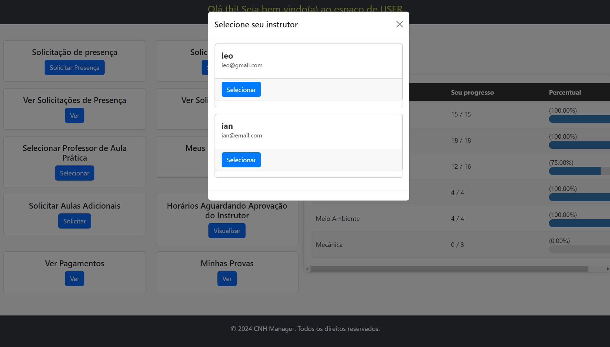

_Nessa tela o aluno pode ver todos os horários disponíveis do instrutor selecionado._

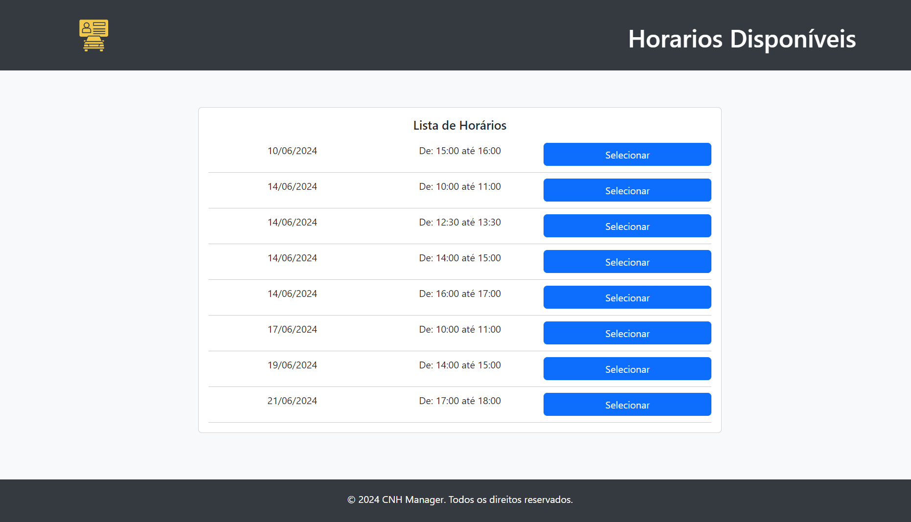

_Tela onde o aluno pode ver todos os horários previamente marcados, podendo cancelar ou confirmar a conclusão._

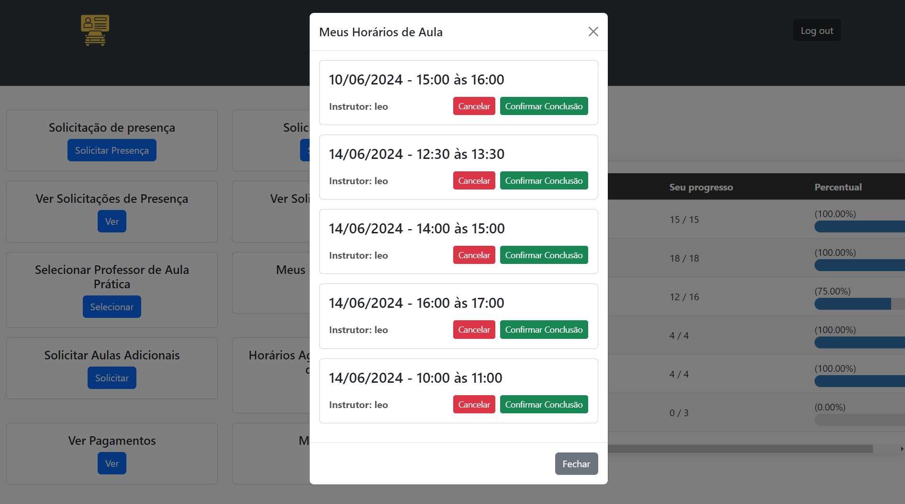

_Tela onde o instrutor pode ver os horários solicitados por seus alunos, podendo aprovar ou negar._

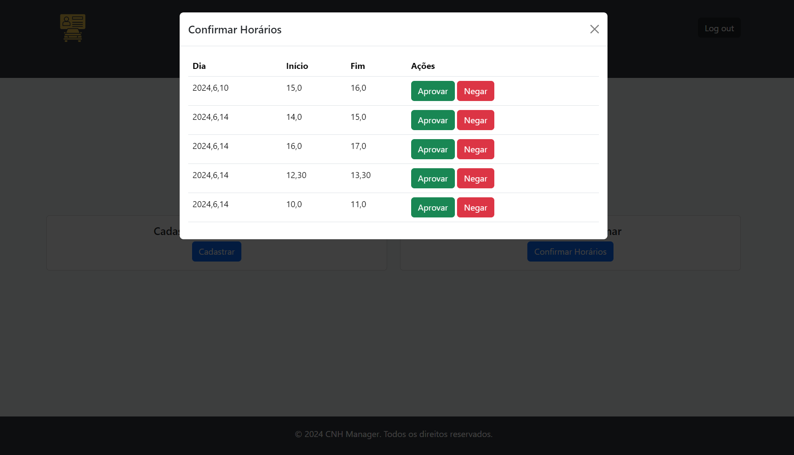

## 6.6. Indicadores de desempenho

_Descrição da tela relativa à atividade 1._

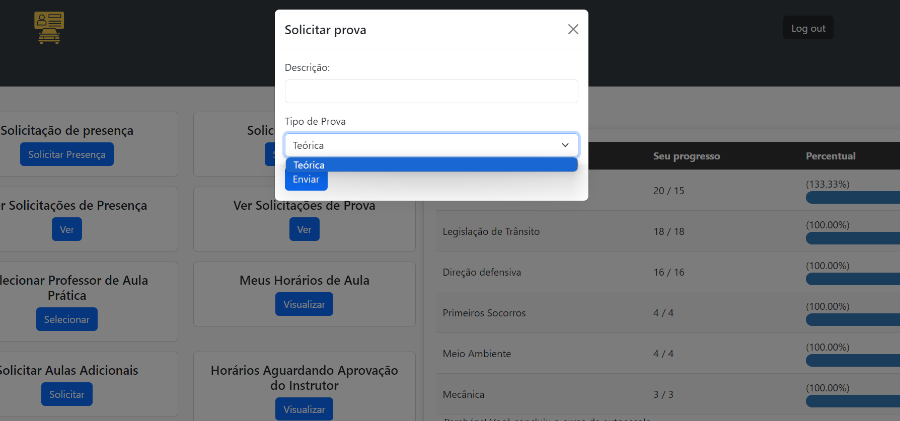

_Descrição da tela relativa à atividade 2._

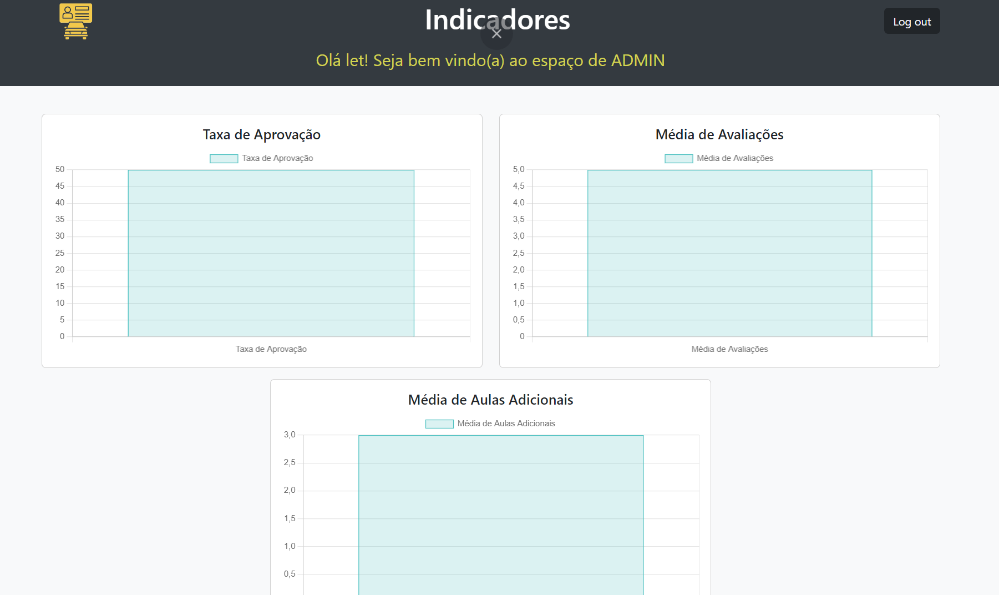
