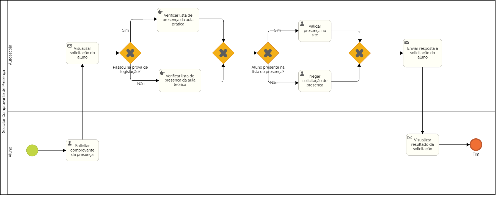

### 3.3.1 Processo 1 – Solicitar comprovante de presença

O Processo de ter a presença comprovada nas aulas teóricas e práticas pode ser melhorado através da oportunidade de fornecer ao aluno uma visualização automatizada do progresso realizado por ele durante a etapa de aulas, tanto práticas quanto teóricas, necessárias para a obtenção da CNH.

#### Detalhamento das atividades

* **Solicitar comprovante de presença**: Através da interface do sistema, o aluno solicita validação de presença em uma aula específica.
* **Visualizar solicitação do aluno**: Através de um procedimento automatizado do sistema, uma mensagem informa à autoescola a respeito da solicitação do aluno
* **Verificar lista de presença da aula prática**: A autoescola verifica manualmente a presença do aluno na lista de presença fornecida pelo instrutor responsavel.
* **Validar presença no site**: A autoescola valida a presença do aluno no site, caso o aluno esteja presente na lista de presença fornecida pelo instrutor responsável.
* **Negar solicitação de presença**: A autoescola nega a solicitação do aluno, caso o aluno não esteja presente na lista de presença fornecida pelo instrutor responsável.
* **Enviar resposta a solicitação do aluno**: O sistema envia a resposta da solicitação vinda da autoescola para o aluno.
* **Visualizar resultado da solicitação**: O aluno visualiza a resposta da autoescola quanto à solicitação que ele fez (Aprovada ou Negada). Caso aprovada, o dashboard pessoal do aluno é atualizado com a presença confirmada. Caso negado, o aluno recebe uma mensagem alegando ausência dele na lista de presença da aula solicitada.

**Solicitar comprovante de presença**

| **Campo**       | **Tipo**         | **Restrições** | **Valor default** |
| ---             | ---              | ---            | ---               |
| Nome            | Caixa de Texto   | mínimo de 5 caracteres |                |
| Email           | Caixa de Texto   | formato de e-mail |           |
| Tipo da aula    | Área de texto   | required |           |
| Data da aula | Data   | required |     01/01/2001      |
| Horário da aula | Hora   | required |    00:00:00        |

| **Comandos**         |  **Destino**                   | **Tipo** |
| ---                  | ---                            | ---               |
| Solicitar            | Envio da solicitação à autoescola | default           |

**Validar presença no site**

| **Campo**       | **Tipo**         | **Restrições** | **Valor default** |
| ---             | ---              | ---            | ---               |
| Nome            | Caixa de Texto   | mínimo de 5 caracteres |                |
| Email           | Caixa de Texto   | formato de e-mail |           |
| Tipo da aula    | Área de texto   | required |           |
| Data da aula | Data   | required |     01/01/2001      |
| Horário da aula | Hora   | required |    00:00:00        |
|  Mensagem           |      Área de texto            |                |                   |

| **Comandos**         |  **Destino**                   | **Tipo**          |
| ---                  | ---                            | ---               |
| Validar presença     | Confirmar presença do aluno |                   |

**Negar presença no site**

| **Campo**       | **Tipo**         | **Restrições** | **Valor default** |
| ---             | ---              | ---            | ---               |
| Nome            | Caixa de Texto   | mínimo de 5 caracteres |                |
| Email           | Caixa de Texto   | formato de e-mail |           |
| Tipo da aula    | Área de texto   | required |           |
| Data da aula | Data   | required |     01/01/2001      |
| Horário da aula | Hora   | required |    00:00:00        |
|  Mensagem           |      Área de texto            |                |                   |

| **Comandos**         |  **Destino**                   | **Tipo**          |
| ---                  | ---                            | ---               |
| Negar presença     | Confirmar presença do aluno |                   |
