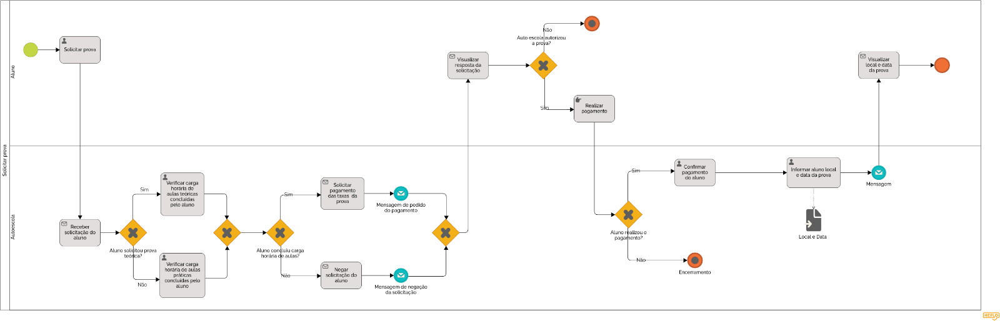

### 3.3.2 Processo 2 – Solicitar Prova

Planejamos otimizar a solicitação de prova automatizando as atividades e tornando mais objetiva a comunicação do aluno com a autoescola. Por parte do estudante será apenas necessário solicitar a prova (diretamente pelo sistema), receber a autorização da autoescola, em seguida pagar as taxas requeridas e por fim receber seu local e data de prova. Por outro lado o funcionário da autoescola irá pelo sistema checar os requisitos necessários para marcar a prova em enviar a resposta ao aluno, dessa forma simplificando todo o processo.

#### Detalhamento das atividades

* **Solicitar a prova:** O aluno solicita a prova que deseja realizar.

* **Receber solicitação do aluno:** A autoescola recebe a solicitação feita pelo aluno.

* **Verificar carga horária de aulas teóricas:** A autoescola verifca a carga horária das aulas teóricas.

* **Verificar carga horária de aulas práticas:** A autoescola verifica a carga horária das aulas práticas.

* **Solicitar pagamento das taxas da prova:** A autoescola envia a solicitação do pagamento das taxas para realização da prova.

* **Negar solicitação do aluno:** A autoescola nega a solicitação feita pelo aluno.

* **Visualizar resposta da solicitação:** O aluno visualiza a resposta dada pela autoescola.

* **Pagar taxas da prova:** O aluno paga as taxas da prova.

* **Receber pagamento:** A autoescola recebe o pagamento das taxas.

* **Marcar prova do aluno:** A autoescola marca a prova do aluno.

* **Informar aluno local e data da prova:** A autoescola informa o aluno o local e data da prova.

* **Visualizar local e data da prova:** O aluno visualiza o local e data da prova.

**Solicitar a prova**

| **Campo**       | **Tipo**         | **Restrições** | **Valor default** |
| ---             | ---              | ---            | ---               |
| Nome            | Caixa de Texto   | mínimo de 5 caracteres |                |
| Email           | Caixa de Texto   | formato de e-mail |           |
| Tipo de prova    | Seleção Única   | required |           |

| **Comandos**         |  **Destino**                   | **Tipo** |
| ---                  | ---                            | ---               |
| Solicitar prova | Enviar solicitação à autoescola | default |

**Verificar carga horária de aulas**

| **Campo**       | **Tipo**         | **Restrições** | **Valor default** |
| ---             | ---              | ---            | ---               |
| Nome            | Caixa de Texto   | mínimo de 5 caracteres |                |
| Email           | Caixa de Texto   | formato de e-mail |           |

| **Comandos**         |  **Destino**                   | **Tipo** |
| ---                  | ---                            | ---               |
| Verificar carga horária | Visualizar carga horária | - |

**Informar ao aluno local e data da prova**

| **Campo**       | **Tipo**         | **Restrições** | **Valor default** |
| ---             | ---              | ---            | ---               |
| Nome            | Área de Texto    | mínimo de 5 caracteres |                |
| Local           | Área de Texto    | formato de local |     Endereço      |
| Data            | Área de texto    | formato de data |     01/01/2001      |
| Hora            | Área de texto    | formato de hora |       00:00:00     |

| **Comandos**         |  **Destino**                   | **Tipo**          |
| ---                  | ---                            | ---               |
| Enviar informações | visualização das informações pelo aluno | default |
