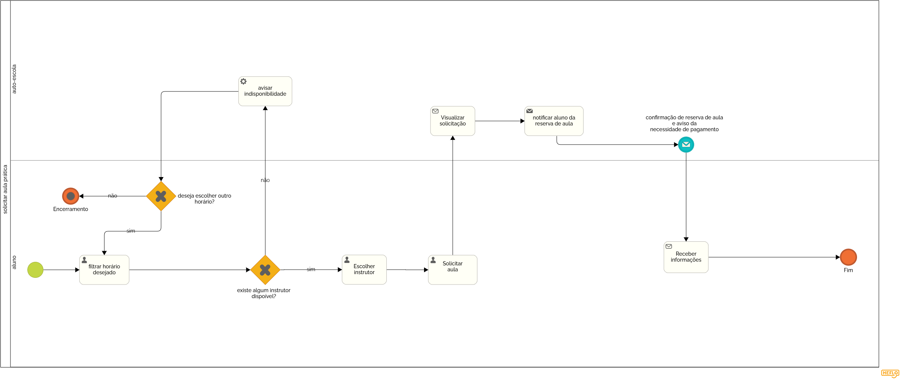

### 3.3.3 Processo 3 – Solicitar Aulas Práticas

#### Detalhamento das atividades

_O processo 3 inicia-se com o aluno decidindo agendar suas aulas práticas. Após comunicar seu interesse à autoescola, a mesma deverá, logo a seguir, verificar se o aluno em questão trata-se de um aluno que pode cursar as aulas práticas, tendo como requisito ter cursado as 40 aulas obrigatórias do curso teórico e ter sido aprovado no exame teórico. Caso o aluno cumpra com todos estes requisitos, será um usuário válido para seguir com o processo. O atendente da autoescola, então, deverá após verificar as disponibilidades em aberto na agenda de instrutores e veículos e notificar o aluno dos mesmos. Caso o aluno selecione um horário e o mesmo ainda esteja disponível após sua análise, o atendente deverá confirmar o horário da aula agendada e notificar o aluno desta confirmação; caso contrário, o aluno será notificado novamente dos novos horários disponíveis, podendo optar a seguir ou não com o processo. Após a confirmação, o atendente agenda oficialmente as aulas na agenda e deverá notificar o instrutor em questão para que este esteja a par de sua nova agenda de serviço. Por fim, será emitido pelo atendente as guias de pagamento referentes às aulas agendadas que serão encaminhadas ao aluno._

#### Detalhamento das atividades

_Os tipos de dados a serem utilizados são:_

_* **Filtrar horário desejado** - o aluno escolhe o horário que mais se adequa a sua realidade_

_* **Escolher instrutor** - o aluno visualiza os instrutores disponíveis e escolhe um de acordo com suas preferências_

_* **Solicitar aula** - ao escolher o horário e o instrutor, o aluno deve confirmar a solicitação por meio de um botão de envio._

_* **Notificar aluno da necessidade de pagamento das aulas** - mensagem com aviso da liberação do processo de pagamento e intruções._

_* **Confirmar pagamento** - a autoescola atualiza o sistema com confirmação de pagamento._

_* **Notificar aluno da reserva de aula** - mensagem confirmando reserva do horário e do intrutor escolhidos._

_* **Enviar confirmação de aulas** - mensagem com a confirmação das aulas e instruções adicionais._

**Filtrar horário desejado**

| **Campo**       | **Tipo**         | **Restrições** | **Valor default** |
| ---             | ---              | ---            | ---               |
| horários disponíveis           | seleção única   | campo de opções |                |
| nome do aluno           | Caixa de Texto   | mínimo de 8 caracteres |           |
| nome do instrutor           | seleção única   | campo opções |           |
| data           | data   | dd-mm-aaaa |     data ao momento de solicitação      |
| horário           | hora   | hh:mm:ss |    hora ao momento da solicitação       |

| **Comandos**         |  **Destino**                   | **Tipo** |
| ---                  | ---                            | ---               |
|   selecionar     |  escolher instrutor  |   default    |

**Escolher instrutor**

| **Campo**       | **Tipo**         | **Restrições** | **Valor default** |
| ---             | ---              | ---            | ---               |
| horários disponíveis           | seleção única   | campo de opções |                |
| nome do aluno           | Caixa de Texto   | mínimo de 8 caracteres |           |
| nome do instrutor           | seleção única   | campo opções |           |
| data           | data   | dd-mm-aaaa |     01/01/2001      |
| horário           | hora   | hh:mm:ss |    00:00:00       |

| **Comandos**         |  **Destino**                   | **Tipo** |
| ---                  |  ---                           | ---               |
| selecionar             |  fluxo agendar com instrutor   |      seleção      |

**Solicitar Aula**

| **Campo**       | **Tipo**         | **Restrições** | **Valor default** |
| ---             | ---              | ---            | ---               |
| horários disponíveis           | seleção única   | campo de opções |                |
| nome do aluno           | Caixa de Texto   | mínimo de 8 caracteres |           |
| nome do instrutor           | seleção única   | campo opções |           |
| data           | data   | dd-mm-aaaa |     01/01/2001      |
| horário           | hora   | hh:mm:ss |    00:00:00       |

| **Comandos**         |  **Destino**                   | **Tipo** |
| ---                  | ---                            | ---               |
| agendar               | Fim do Processo 3             |   default  |

**Confirmar pagamento**

| **Campo**       | **Tipo**         | **Restrições** | **Valor default** |
| ---             | ---              | ---            | ---               |
| Checkbox | Seleção única | required | Null |
| Confirmação |Seleção única | required  | Null |

| **Comandos**         |  **Destino**                   | **Tipo**          |
| ---                  | ---                            | ---               |
| Selecionar pagamento | Enviar confirmação | - |
