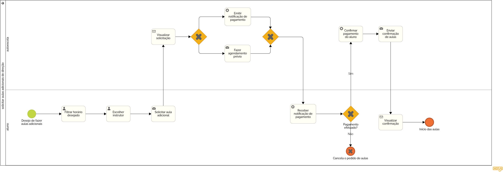

### 3.3.4 Processo 4 – Solicitar aulas adicionais de direção

O processo de "Solicitação de Aulas Adicionais de Direção" tem como objetivo simplificar a comunicação entre o aluno e a autoescola quando o estudante deseja realizar aulas além das 20 obrigatórias estabelecidas pelo Conselho Nacional de Trânsito (Contran). Durante esse processo, o aluno tem a capacidade de requisitar essas aulas e receber a confirmação destas, assim como a notificação para o pagamento das mesmas.

#### Detalhamento das atividades

* **Filtrar horários disponíveis** - O aluno filtra os horários desejados.
* **Escolher instrutor** - O aluno escolhe o instrutor que deseja fazer as aulas.
* **Solicitar aula adicional** - O aluno solicita as aulas adicionais, com o instrutor escolhido.
* **Visualizar solicitação** - A autoescola visualiza a solicitação de aulas do aluno.
* **Emitir notificação de pagamento** - A autoescola notifica o aluno a respeito da necessidade de pagamento das aulas requisitadas pelo mesmo.
* **Fazer agendamento prévio** - A autoescola faz um agendamento prévio das aulas requisitadas pelo aluno.
* **Receber notificação de pagamento** - O aluno visualiza a notificação emitida pela autoescola.
* **Enviar confirmação de aulas** - A autoescola envia a confirmação do agendamento das aulas.
* **Visualizar confirmação** - O aluno recebe a confirmação do agendamento das aulas.

**Filtrar horário desejado**

| **Campo**       | **Tipo**         | **Restrições** | **Valor default** |
| ---             | ---              | ---            | ---               |
| Horários disponíveis | hora        |(hh:mm:ss)      |00:00:00         |

| **Comandos**         |  **Destino**                   | **Tipo** |
| ---                  | ---                            | ---               |
| Filtro de horários | Selecionar horário | hora |
| Selecionar horário | Visualizar instrutores | hora |

**Escolher instrutor**

| **Campo**       | **Tipo**         | **Restrições** | **Valor default** |
| ---             | ---              | ---            | ---               |
| Nome Instrutor| caixa de texto | maximo 50 caracteres  |  |
| Foto do instrutor  | Imagem | 400x400 |  |

| **Comandos**         |  **Destino**                   | **Tipo**          |
| ---                  | ---                            | ---               |
| Selecionar instrutor | Confirmar seleção | seleção |
| Confirmar seleção | Solicitar aula adicional | seleção |

**Confirmar pagamento**

| **Campo**       | **Tipo**         | **Restrições** | **Valor default** |
| ---             | ---              | ---            | ---               |
| Checkbox | Seleção única | required | unchecked |
| Confirmação | caixa de texto | pagamento aprovado  | unchecked |

| **Comandos**         |  **Destino**                   | **Tipo**          |
| ---                  | ---                            | ---               |
| Selecionar pagamento | Enviar confirmação |  |

 
