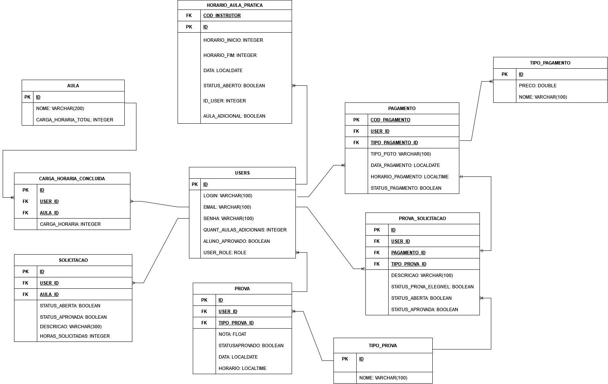

## 4. Projeto da solução

### 4.1. Modelo de dados

---

### 4.2. Tecnologias

| **Dimensão**                          | **Tecnologia**                            |
|---------------------------------------|-------------------------------------------|
| Linguagem de Programação (Backend)    | Java                                      |
| Framework (Backend)                   | Spring Boot                               |
| Servidor de Aplicação                 | PostgreSQL                                |
| Tecnologias Padrão (Frontend)         | HTML, CSS, JavaScript                     |
| Framework CSS (Frontend)              | Bootstrap                                 |
| SGBD                                  | PostgreSQL                                |
| API e Integração                      | APIs RESTful                              |
| Formato de Troca de Dados             | JSON                                      |
| Controle de Versão                    | GitHub                                    |
| Gerenciamento de Projeto              | GitHub Projects com modelo Kanban         |

